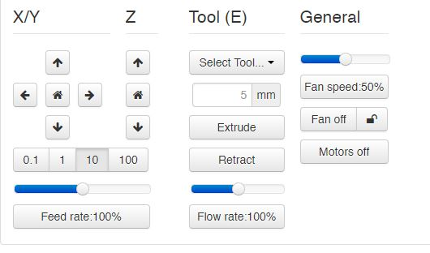

# OctoPrint-FanSpeedSlider

Adds a slider to control the speed of a parts cooling fan.

*Note: Slider does __not__ follow the speed of the fan. If the fan speed is set via gcode or an LCD panel on the printer, the slider will not respond to the change.*

## Setup

Install manually using this URL:

    https://github.com/ntoff/OctoPrint-fanspeedslider/archive/master.zip

